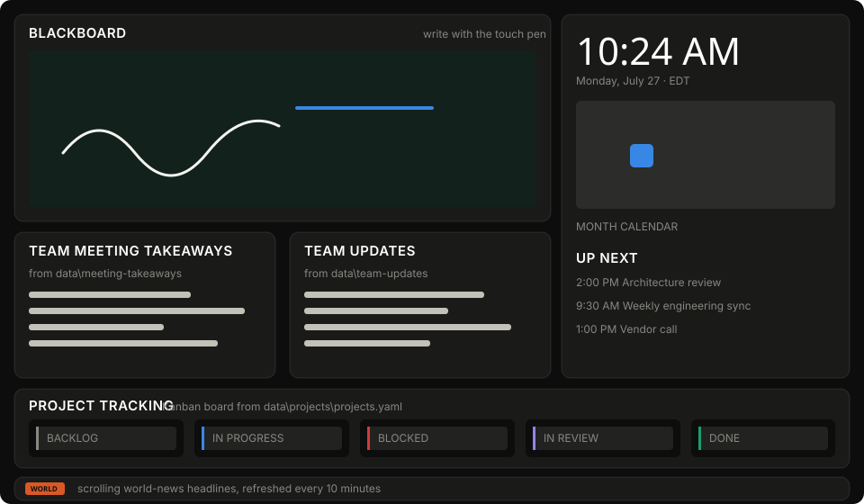

# Engineering Team Dashboard

A full-screen wall display for a touchscreen TV, laid out as four swipeable pages.

**Page 1 -- Overview:** meeting takeaways and team updates pulled straight out of
folders, and the date/time with calendar and agenda -- each running the full
height of the wall.
**Page 2 -- Projects:** a full-screen Kanban board with owners, priority, due
dates, health and progress.
**Page 3 -- Area Coverage:** a full-screen board of who is covering which area
today; drag an engineer between areas with a finger.
**Page 4 -- Weather & Travel:** today's outlook for the county plus one merged
"affecting your drive" list — weather alerts and road incidents (accidents,
jams, closures) — so engineers can plan the commute and trips to remote sites.

Swipe left and right to move between them, or tap **Overview** / **Projects** /
**Coverage** / **Travel** in the bottom bar. A scrolling world-news ticker runs
across all pages.

Left alone, the wall **cycles the pages by itself** so an unattended TV shows
everything — an **AUTO** marker sits by the page dots while it does, and each
change is a quick **CRT channel-flip** (a tap on Overview/Projects/Coverage or
the arrow keys gets it too; a live finger-swipe stays a smooth slide). Touching
the wall (tap, swipe, or key) pauses the cycle; it resumes once the wall has
been idle a while. Tune the dwell with `PAGE_CYCLE_SECONDS` (seconds per page;
`0` turns it off and leaves paging fully manual).

Everything updates by itself. Drop a Word doc in a folder and it is on the wall a
second later — nobody has to touch the TV.



---

## What's on screen

| Section | Where its content comes from |
|---|---|
| **Area Coverage** (page 3) | `data\coverage\coverage.yaml` — engineer cards you drag between area columns. Saved to disk and mirrored to any other screen showing the dashboard. |
| **Team Meeting Takeaways** | Every `.docx` / `.pdf` / `.md` / `.txt` in `data\meeting-takeaways`. Newest first, auto-rotating. |
| **Team Updates** | Same, from `data\team-updates`. One file per project or per person works well. |
| **Project Tracking** | `data\projects\projects.yaml` — a Kanban board with owners, priority, due dates, health and progress. |
| **Date / time / calendar** | The clock, a month grid, and the next few events from your calendar's ICS link. Use **‹ ›** to change month (**Today** returns), tap ⤢ for a full-screen month, or tap any day for its schedule. |
| **Weather & Travel** (page 4) | Today's outlook from the National Weather Service (free) plus road incidents from TomTom (free key), merged into one "affecting your drive" list. See [Weather & traffic](#weather--traffic-the-travel-page). |
| **News ticker** | RSS world-news feeds, refreshed every 10 minutes. |

---

## Setup on Windows

**Requirements:** Windows 10 or 11, and Python 3.11+.
If you don't have Python: `winget install --id Python.Python.3.12 --source winget`
(or grab it from python.org and tick *Add python.exe to PATH*).

1. Copy this `dashboard` folder onto the PC driving the TV.
2. Double-click **`Install.bat`**.
   It builds a private virtual environment, installs the dependencies, creates
   `dashboard.env`, and registers a task that starts the wall when the display
   user signs in. No admin rights, nothing installed machine-wide.
3. Open **`dashboard.env`** in Notepad and set at least:
   - `DASHBOARD_TZ` — your timezone, e.g. `America/New_York`
   - `CALENDAR_ICS_URLS` — your calendar's ICS link (optional; see below)
4. Double-click **`Start Dashboard.bat`**.

The server starts hidden and a dedicated Edge window opens full-screen on the TV.

**Coming back on its own after a reboot.** The full-screen browser needs a
signed-in desktop session, so the logon task only relights the wall once the
display user signs in. For an unattended TV — one that recovers by itself after
a Windows Update reboot or a power cut — set the PC to sign in automatically:
run `Install.bat` from an Administrator prompt with `-EnableAutoLogon`, or set
it by hand (`netplwiz`, or Sysinternals Autologon for an encrypted password).
The installer prints these steps and warns when auto sign-in isn't configured.

On a fresh install the `data\` folders start empty, so `Install.bat` seeds them
with the examples in `samples\` — the wall looks alive on first run. It only
ever seeds a folder that is empty, so it never overwrites real content.

### Updating to a new build

Unzip the new build over the `dashboard` folder and run `Start Dashboard.bat`.

**Your content is safe.** The `data\` folder — the project board, everything the
team has posted — and your `dashboard.env` are yours; they live only on this
machine and are never part of a build, so an update cannot overwrite them. A
build only replaces the program (the `backend\`, `frontend\`, `windows\` and
`samples\` folders). You do not need to re-run `Install.bat` unless a release
note says a new dependency was added.

**Everyday controls**

| Action | How |
|---|---|
| Start it | `Start Dashboard.bat`, or the *Team Dashboard* desktop shortcut |
| Change page | Swipe left/right, tap **Overview** / **Projects** / **Coverage**, or press `←` `→` (or `1` / `2` / `3`) |
| Minimise, close, or shut down | Tap the **power icon** at the right of the bottom bar |
| Leave kiosk mode by keyboard | `Ctrl+W` or `Alt+F4` on the TV |
| Stop the server from a terminal | `windows\Stop-Dashboard.ps1` |
| Run windowed while setting up | `Start Dashboard.bat -Windowed` |
| Server only, no browser | `Start Dashboard.bat -NoBrowser` |
| Remove it | `windows\Uninstall-Dashboard.ps1` (your `data\` folder is kept) |

Logs land in `dashboard.log` and `dashboard.stdout.log` next to the app.

### The drop page -- how the team posts (recommended)

Set `DASHBOARD_HOST=0.0.0.0` in `dashboard.env` and restart. Anyone on the
office network then opens **`http://<tv-pc-name>:8770/drop`** in any browser,
picks a destination, drags a file in, and it is on the wall within a second.

No file share to map, no login, nothing to install. The address is not shown on
the wall (deliberately — the TV is a public surface); hand it out internally to
the people who need it.

Hand out `docs/Team-Dashboard-One-Pager.pdf` -- a single printable page
covering posting, what reads well on a wall, the project board and the
area-coverage board. Pin one by the TV, email the rest. There is a companion
`docs/Formatting-One-Pager.pdf` for anyone who wants the exact formatting rules.

**What the drop page accepts:** `.docx`, `.pdf`, `.md`, `.txt`, up to 25 MB.
Filenames are rebuilt from safe characters, path traversal is refused, and a
repeat filename is kept alongside the original rather than overwriting it.

**Trust model:** uploads are allowed from the LAN because that is the entire
point; a posted document is additive and reversible. Editing the board and
coverage from the LAN is off by default — a browser at someone's desk is
read-only — and is enabled only by setting a shared **edit key** (see below).
The display-control endpoints (minimise / shut down) stay loopback-only no
matter what, so nobody browsing the wall can turn it off. Keep it all on a
trusted network.

### Editing the board from a desk (the edit key)

By default only the TV can change the board. To let a few trusted people edit
from their own machines — drag cards, update progress, reassign coverage,
archive documents — set a shared key in `dashboard.env`:

```
DASHBOARD_HOST=0.0.0.0
EDIT_KEY=choose-a-passphrase
```

Then on a LAN browser at `http://<tv-pc-name>:8770/`, the first edit prompts for
the key; it is remembered in that browser and sent as a header on writes. The
key is compared in constant time and rides in a header (not a cookie), so a
cross-site page can't ride along on it. Caveats worth knowing:

- It travels over plain HTTP on your LAN, so treat it as a low-stakes shared
  password, not real authentication — anyone who can sniff the network or is
  told the key can edit. Fine for a project board on a trusted network.
- With `EDIT_KEY` unset, the LAN stays read-only (the secure default).
- Do not print the key in anything you distribute widely; hand it to the few
  people who need it.

### Letting the team drop files from their own desks

By default the dashboard reads the `data\` folder beside the app. Point it at a
share instead and everyone can update the wall without walking over to it — set
these in `dashboard.env`:

```
TAKEAWAYS_DIR=\\fileserver\team\dashboard\meeting-takeaways
UPDATES_DIR=\\fileserver\team\dashboard\team-updates
PROJECTS_DIR=\\fileserver\team\dashboard\projects
```

The watcher handles UNC paths and SMB shares. If the share is briefly
unreachable the panel keeps showing what it last read.

### Viewing it from another machine

Set `DASHBOARD_HOST=0.0.0.0` in `dashboard.env`, restart, and open
`http://<tv-pc-name>:8770/` from any browser on the LAN. Handy for checking the
board from your desk. Windows Firewall will prompt once — allow it on the
private network only.

Viewing is open to the LAN; editing requires the edit key (above). Keep it on a
trusted network.

---

## Filling in the content

### Meeting takeaways and team updates

Drop files in the folder. That's the whole workflow.

- **Word** (`.docx`) — headings, bullets, and tables are picked up.
  A `Heading 1` at the top becomes the card title.
- **PDF** — text is extracted and headings/bullets are inferred from the layout.
  Scanned PDFs need OCR first; this reads text, not pictures of text.
- **Markdown** / **plain text** — `#` headings and `-` bullets render as you'd expect.

For a printable authoring guide — exactly which headings, bullets and tables
render (and what doesn't: bold, code blocks, Markdown tables, images), across
both document folders and the project board — hand out
`docs/Formatting-One-Pager.pdf` (source: `docs/FORMATTING-ONE-PAGER.md`).

Files are ordered newest-first and the panel cycles through them every 25
seconds (`ROTATION_SECONDS`). Touch a panel to hold it — rotation resumes on its
own after 90 seconds. The `‹ ›` buttons page manually, and `⤢` blows the panel
up full-screen for a closer read.

**Drop celebration.** When a genuinely new file lands, a silent, retro-themed
banner slides onto the wall naming the folder ("Team Update", "Meeting
Takeaway") and the filename. It stays until someone **taps it** — every drop is
acknowledged by a person, never dismissed by a timer. Only one shows at a time:
a burst of drops **queues off-screen**, and each tap plays that badge's exit and
brings in the next, oldest first, until the wall is caught up on the latest.
Each drop uses the next of fourteen badges (Pokémon battle box, Street Fighter
"new challenger", Mario 1-UP, Xbox achievement, cinema marquee, Zelda "item
get!", Pac-Man, Space Invaders, Game Boy, The Matrix, Tron, Skyrim, Lord of the
Rings, and Halo), and each badge has its own entrance and exit — the Pokémon faints,
the Street Fighter card gets K.O.'d, Mario hops off the bottom, Pac-Man chomps
its banner away, Tron de-rezzes, the Ring's inscription cools to dark, and so
on. Adding another is a small, self-contained job: one entry in the `BADGES`
array in `frontend/js/dropbanner.js` plus a matching CSS badge and exit. It fires only on new arrivals —
the files already there when the wall starts don't trigger it — and never on
archiving. All of it is pure CSS in `frontend/js/dropbanner.js`; there are no
sound files, fonts, or images to ship.

**Archiving.** The box icon in a panel's header archives the document currently
showing; a short "Archived …" toast confirms it.
Archiving moves the file into an `archive\` subfolder of that folder
(`data\team-updates\archive`, `data\meeting-takeaways\archive`); nothing is
deleted, it just stops showing on the wall, and you can move it back by hand.
Only the display itself can archive; a browser watching from a desk is read-only.

### Project board

Edit `data\projects\projects.yaml`. The header comment in that file documents
every field; the short version:

```yaml
board:
  name: Engineering Delivery
  columns: [To Do, Selected, In Progress, In Review, Done]

projects:
  - id: INF-114
    title: Proxmox cluster HA failover
    owner: Kevin Caughman
    status: In Progress
    priority: high
    total: 8
    complete: 5
    due: 2026-08-14
    tags: [infra, proxmox]
    milestones:
      - name: Live migration smoke test
        due: 2026-08-14
        done: false
```

Only `title` is required. Everything else has a sensible fallback:

- **Health** (on-track / at-risk / off-track) is derived from the due date and
  progress unless you set it explicitly. Past due reads off-track; under a week
  out with less than 75% done reads at-risk.
- **Progress** — set `total` + `complete` to track a count (progress becomes
  `complete/total`, the card shows how many are left, and reaching the total
  moves it to **Done**). Otherwise it falls back to a plain `progress:` value,
  then the share of completed milestones, then the column.
- **Status** accepts what people actually type — `wip`, `qa`, `ready`,
  `shipped` all land in the right column. The columns are To Do, Selected,
  In Progress, In Review and Done (change them under `board.columns`).

Cards sort most-urgent-first inside each column: overdue, then priority, then
due date. You can split projects across several `.yaml`/`.json` files in the
folder; they merge into one board.

> The first install copies `samples\projects\projects.yaml` into
> `data\projects\` as a starting point. After that the file is yours — edit it
> freely, or manage the board entirely from the touchscreen. Updates never
> touch it. To start over from the example, delete your `data\projects\`
> contents and re-run `Install.bat`.

#### Moving cards

The board is not read-only. On the display itself — and, once the edit key is
set, from a LAN browser too:

| Gesture | What happens |
|---|---|
| **Add a project** | Tap **+ New project** at the bottom of any column, type a title (and optional owner) when prompted, and a card is created in that column — it opens straight away so you can set progress, due and milestones. Appended to `projects.yaml` with a title-based id. |
| **Tap a card** | Opens its detail sheet: full description, every milestone, tags, and buttons to move it to any other column. |
| **Tick a milestone** | Writes `done: true` back to the YAML. Progress recalculates from the milestone count unless you set `progress:` explicitly. |
| **Set progress by count** | Tap **Complete** or **Total** and a numpad pops out (a physical keyboard works too); the percentage and "remaining" follow as you enter, and reaching the total moves the card to **Done** on its own. Written back as `total:` / `complete:`. |
| **Change the due date** | Pick a date (touch or keyboard) in the date field; **Clear** removes it. |
| **Press and hold a card, then drag** | Lifts the card and drops it in another column. |

Changes are written straight back into `projects.yaml`, so the file stays the
source of truth and the wall never drifts from it. Specifically:

- **Your comments survive.** Writing uses a round-trip YAML parser, so the
  schema notes at the top of the file and any comments you add are preserved
  exactly. Formatting and quoting stay as you wrote them.
- **Hand edits win.** If the file changed on disk since the dashboard read it --
  someone saving in Notepad, or a `git pull` -- the write is refused and a
  message appears on screen rather than overwriting their work.
- **Writes are gated.** The display always writes; a LAN client is refused
  unless it carries the shared edit key (see "Editing the board from a desk").
  With no key set, only the display can write.

Dates are written back in your file's own style -- `due: 2026-08-14`, unquoted,
not turned into a string.

The hold before a drag is deliberate: without it, every attempt to scroll a
column would start a drag instead. A quick flick scrolls; a hold lifts.

### Calendar

Paste one or more ICS URLs into `CALENDAR_ICS_URLS`, comma-separated.

- **Google Calendar** → Settings → your calendar → *Secret address in iCal format*
- **Outlook / Microsoft 365** → Settings → Calendar → Shared calendars → *Publish a calendar* → ICS link

**Multiple calendars.** List several, comma-separated — the wall merges them
into one month grid and agenda, gives each calendar its own colour, and shows
a small legend so you can tell them apart (colours and the legend appear once
there are two or more). Label each one with `Name = URL` so the legend reads well:

```
CALENDAR_ICS_URLS=Team = https://.../team.ics, On-call = https://.../oncall.ics
```

Each calendar gets an automatic colour from the palette. **To pick your own,
put a `#hex` after the name** — no touchscreen or code needed, just this file:

```
CALENDAR_ICS_URLS=Team #2e8b57 = https://.../team.ics, On-call #d55181 = https://.../oncall.ics
```

Without a label, the calendar's own published name is used, falling back to its
host. Every event carries its calendar's colour on its left edge in the agenda,
the day sheet and the expanded month view, and a **multi-day event shows on
every day it covers**.

Recurring events are expanded locally, so the wall shows the next real
occurrence. Leave it blank for a clean month grid with no events.

If a feed stops answering, the wall keeps the last good events and shows a small
amber line under the grid ("Calendar feed unreachable · last updated 2 h ago"),
so an old schedule reads as old rather than being mistaken for the live one.

> The secret ICS link grants read access to that calendar to anyone who has it.
> Keep `dashboard.env` off shared drives and out of version control.

### News ticker

`NEWS_FEEDS` takes any comma-separated list of RSS/Atom URLs. Duplicate wire
stories are collapsed. If the network drops, the last good pull stays on screen
and the timestamp on the right turns amber rather than the ticker going blank.

---

### Weather & traffic (the Travel page)

The Travel page shows today's outlook and a single **"affecting your drive"**
list that merges weather alerts with road incidents, worst first.

- **Weather** is the US **National Weather Service** — free, no key. Set
  `WEATHER_POINT` to your `lat,lon` and `WEATHER_PLACE` to the label on the wall
  (defaults to Charleston, SC / Charleston County). It shows the day's forecast,
  a few upcoming periods, and any active alerts (flood, wind, heat, fog).
- **Traffic** comes from **TomTom** and needs a free key: sign up at
  `developer.tomtom.com`, create a key, and put it in `TRAFFIC_API_KEY`. Set
  `TRAFFIC_BBOX` to the area to watch (`minLon,minLat,maxLon,maxLat`; the default
  covers greater Charleston). It surfaces accidents, jams, lane/road closures and
  flooding, each with the road and the delay. **Leave the key blank and the page
  shows weather only** — no errors, it just says live traffic isn't configured.

Both fail soft like the news ticker: a dropped pull keeps the last good data on
screen and marks itself stale rather than blanking. Weather refreshes every 15
minutes, traffic every 3 (`WEATHER_REFRESH_SECONDS` / `TRAFFIC_REFRESH_SECONDS`).

> The wall must be able to reach `api.weather.gov` and `api.tomtom.com` on your
> network for this page to populate.

---

## Area coverage

Page 3 is the daily coverage board: each engineer is a card, each area is a
column. Drag a card to the area that person is covering today and the change
saves itself; any other screen showing the dashboard updates within a second.

- Areas and engineers both come from `data\coverage\coverage.yaml`, which
  documents itself at the top. Edit the file to add or rename either.
- Anyone off today: leave their `area` blank, or drag their card to the
  **Off / Unassigned** column. An unrecognised area also lands there, with a
  note under the board so a typo is not silent.
- The coverage page gets the whole screen. A finger dragging a card **moves**
  it rather than changing page -- nobody should flip the page mid-drag -- so use
  the **‹ Overview** button in the header, the page buttons in the bottom bar,
  or the `←` key to go back.

## Closing the dashboard

The power icon at the right of the bottom bar opens a sheet with three choices:

| Choice | What happens |
|---|---|
| **Minimise** | The window hides. Server and browser both keep running; reopen from the taskbar. |
| **Close the display** | The kiosk window closes cleanly. The server stays up, so `Start Dashboard.bat` reopens it in a second. |
| **Shut everything down** | Window closes and the server stops. Next start does the full launch. |

The icon only appears on the display machine itself. The endpoints behind it are
refused for any non-loopback client, so nobody browsing the wall from their desk
can shut it down -- and the launcher passes `--no-proxy-headers` so that check
reads the real socket, not a header a client can set.

---

## How it works

```
Windows PC on the TV
├─ python -m uvicorn backend.app:app     hidden background process
│   ├─ watchdog        folder change → SSE push → panel repaints
│   ├─ SSE /api/stream one connection per screen, auto-reconnects
│   └─ polls RSS every 10 min, ICS every 15 min
└─ Edge --kiosk http://localhost:8770    dedicated profile, own window
```

The frontend is plain ES modules and CSS — no build step, no npm, nothing to
compile. Edit a file in `frontend\` and reload the TV.

**Tests.** A fast, offline smoke suite guards the things that would break the
wall quietly — every API endpoint answers, the edit-key gate holds, an upload
lands, a board move is written back to the YAML, and every frontend module
parses. It runs against a throwaway copy of `samples\`, with no network and no
live server, in about a second:

```
pip install -r requirements.txt -r requirements-dev.txt
pytest
```

In Claude Code on the web these dependencies are installed automatically by the
`.claude/hooks/session-start.sh` hook, so `pytest` just works in a fresh session.

| Path | What it is |
|---|---|
| `backend\app.py` | Routes, SSE fan-out, write endpoints |
| `backend\config.py` | Every environment variable |
| `backend\sources\documents.py` | Word / PDF / Markdown → renderable blocks |
| `backend\sources\projects.py` | YAML → board model, health and progress rules |
| `backend\sources\coverage.py` | YAML → area-coverage board, read and write |
| `backend\sources\news.py` | Feed fetching, dedupe, failure handling |
| `backend\sources\agenda.py` | ICS parsing and recurrence expansion |
| `backend\watcher.py` | Debounced filesystem watching |
| `frontend\js\*.js` | One module per panel |
| `frontend\css\dashboard.css` | The whole stylesheet |

### API

| Endpoint | Purpose |
|---|---|
| `GET /api/state` | Everything at once — what a fresh screen loads |
| `GET /api/stream` | Server-sent events; pushes `content` updates per channel |
| `GET /api/takeaways`, `/api/updates`, `/api/projects`, `/api/coverage`, `/api/news`, `/api/agenda` | Individual panels |
| `POST /api/projects/{id}/status`, `/completion`, `/due`, `/milestone` | Move a card, set its Total/Complete counts, set its due date, tick a milestone (loopback only) |
| `POST /api/coverage/{engineer}/area` | Reassign an engineer to an area (loopback only) |
| `POST /api/upload` | Post a document to a watched folder (allowed from the LAN) |
| `GET /api/health` | Liveness, plus how many screens are connected |

---

## Design choices worth knowing

**Dark only.** A white panel on a wall is a lamp pointed at the room. The theme
is a deliberate single look, not a missing feature.

**Colour is doing a job, not decorating.** Series colours come from a palette
validated for colour-blind separation against the exact surface the cards sit
on. Project health always ships as icon + word + colour, so it never depends on
hue alone. The status colours (green/amber/red) are reserved for health and are
never reused as a category colour.

**Sized for distance.** Type scales with the viewport, so the same layout works
on a 43" desk-side panel and a 75" wall. Touch targets are at least 44px.

**Degrades quietly.** Feeds down, share unreachable, a corrupt file in a folder —
each of those affects one panel and says so in small text. Nothing takes the
wall down.

---

## Troubleshooting

| Symptom | Fix |
|---|---|
| "Method not allowed" when moving a card | A server from an older build is still running. `windows\Stop-Dashboard.ps1`, then `Start Dashboard.bat`. Newer builds detect this and restart automatically. |
| "No suitable Python was found" | Install Python 3.11+, tick *Add to PATH*, re-run `Install.bat` |
| Panel stuck on old content | Check the file isn't still open in Word — Word holds a lock and writes a `~$` temp file, which is ignored |
| PDF shows nothing | It's probably a scan. Run OCR on it first |
| Ticker empty, timestamp amber | Network or feed URL problem — check `dashboard.log` |
| Calendar empty | Confirm the ICS link opens in a browser and returns a `.ics` file |
| Kiosk mode ignored | Close all other Edge windows, or just re-run `Start Dashboard.bat` — it uses its own profile |
| TV sleeps | The start script sets the power timeouts, but check Windows Settings → Power |
| Coverage change not sticking | A message appears under the board if the file changed on disk mid-drag; otherwise check `dashboard.log` |

Reset everything without losing content: `windows\Uninstall-Dashboard.ps1` then
`Install.bat`. Your `data\` folder and `dashboard.env` are left alone.

---

## Running it somewhere other than Windows

The backend is plain Python and has no Windows-specific code:

```bash
python -m venv .venv
.venv/bin/pip install -r requirements.txt
.venv/bin/python -m uvicorn backend.app:app --host 0.0.0.0 --port 8770
```

Configure it with the same variables as `dashboard.env`, exported into the
environment. On a Raspberry Pi driving the TV, add a systemd unit and launch
Chromium with `--kiosk http://localhost:8770`.
